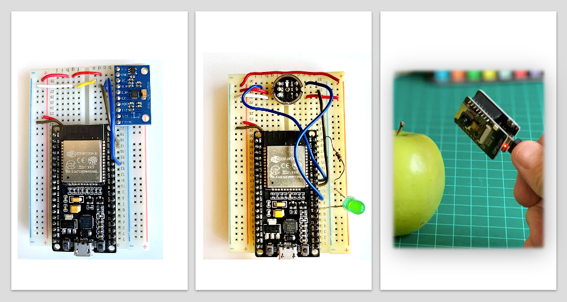

# ESP32-TinyML
Exploring TinyML with ESP32 MCUs. 

## Tutorials
- [Vision - Image Classification](https://www.hackster.io/mjrobot/esp32-cam-tinyml-image-classification-fruits-vs-veggies-4ab970)
- [Motion - Motion Classification](https://github.com/Mjrovai/ESP32-TinyML/blob/main/ESP32-Motion_Classification/ESP32_ACC-Motion_Classification.pdf)
- [Sound - KeyWord Spotting](https://github.com/Mjrovai/ESP32-TinyML/blob/main/ESP32-KWS/ESP32-KWS.pdf)
